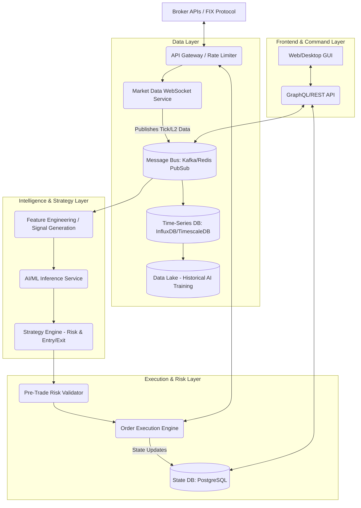

# Architect's Review & Target Architecture

## Current State Assessment
The current platform operates primarily as an advanced execution and state-tracking layer. 
It uses Python (FastAPI/asyncio) on the backend to manage websockets and API calls with the broker, and a lightweight web interface for the frontend. State persistence currently relies on atomic JSON writes.

### Technical Gaps & Limitations for the "Powerhouse" Goal
1. **State Persistence Bottleneck**: File-based JSON persistence (`store.py`) is sufficient for low-frequency and manual trading, but will bottleneck heavily when the platform transitions to HFT or requires analyzing thousands of simultaneous market ticks.
2. **Data Streaming Architecture**: Currently, market data streams directly from the broker to the Python backend via WebSockets. To support distributed systems, ML pipelines, and cloud transition, we need a decoupled Pub/Sub architecture.
3. **Time-Series Data Storage**: Lack of a dedicated Time-Series Database (TSDB) limits historical backtesting and AI model training on tick-level data.
4. **Execution Engine Coupling**: Algorithm logic and execution logic share the same lifecycle loop. For HFT, these need to be separated into a Strategy Engine (evaluating signals) and an Execution Engine (routing orders).

## Target Architecture (High-Level Overview)

The target architecture represents the transition from a monolithic desktop setup to a scalable, cloud-ready prop-trading engine.

## Prioritization Matrix (Value vs. Cost)
1. **Immediate Value (Low Cost)**: Replace atomic JSON writes with SQLite or a local PostgreSQL instance to eliminate locking bottlenecks as logic scales.
2. **Medium Value (Medium Cost)**: Introduce Redis for local pub/sub. Decoupling the WebSocket listener from the order-manager loop.
3. **High Value (High Cost)**: Implement the Time-Series DB (e.g., QuestDB or TimescaleDB) for recording L2/Tick data to pave the way for Hat #4 (Data Science).
4. **Future Value (High Cost)**: Cloud-native deployment (Kubernetes) for scalable HFT.
